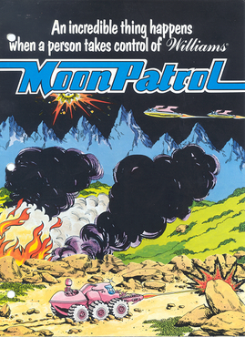
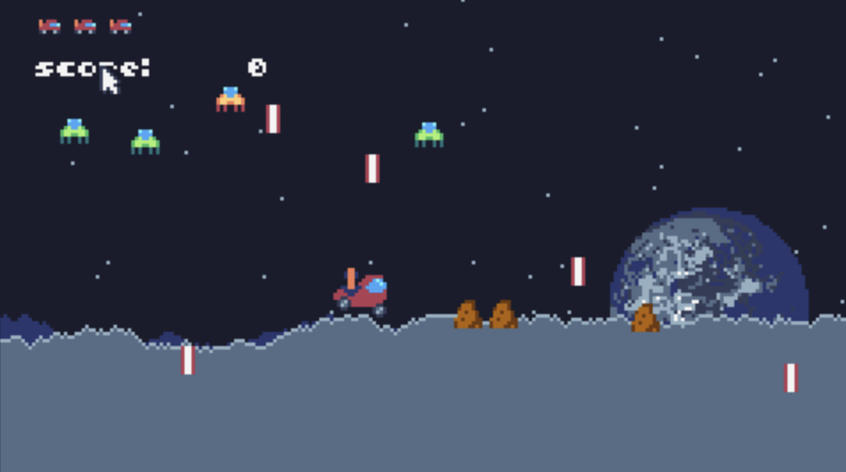

## Moon Patrol: Remake



Moon Patrol was originally produced by Irem, a Japanese video game company, for arcades. It was eventually licensed to Williams (WMS Industries) for distribution across North America. In the original arcade version of the game, the player is in control of a moon buggy and is able to jump over and shoot obstacles such as pits, boulders, and enemies. The original arcade version of Moon Patrol is also credited with the introduction of full parallax scrolling in the side-scrolling game genre. Parallax scrolling is a technique often used in computer graphics where the background images in a scene move past the camera more slowly than images in the foreground. This then creates an illusion of depth in a 2D scene. In Moon Patrol, there are three different background layers that all scroll at different speeds which simulates distance. 

#### STORY AND GAMEPLAY:
In the game, humans have managed to make civilization on the Moon, of course with this means that it must now be monitored and policed. Players take control of a police officer in Luna City that is assigned to Sector Nine, the most dangerous part of the city filled with the “toughest thugs in the galaxy.” In both the arcade version and Atari 2600 version, the player controls a Moon buggy that travels continuously to the right over a horizontally scrolling Moon landscape. There are obstacles on the ground that must be avoided like mines and craters. There are also UFO’s and other enemy types that travel above in the skies and shoot down the Moon buggy. The game has 26 checkpoints each divided into the letters of the alphabet. The arcade version is more comprehensive with five checkpoints at certain letters that completely change the landscape and theme.


#### GRAPHICS:
It's important to note that the Atari 2600's hardware limitations mean the graphics are much simpler compared to the arcade original. However, the game's graphical charm lies in its ability to capture the essence of the original within the constraints of the hardware.
While the Atari 2600 couldn't match the graphical fidelity of the arcade version, Moon Patrol still manages to try with its visuals. The moon's surface is represented as a flat surface, with distinct craters and varying terrain to traverse. Your Moon Buggy and the alien ships are easily recognizable, and the scrolling backgrounds give the sense of moving through a lunar landscape. Although the sprite work leaves much to be desired. The buggy becomes one color and essentially becomes an oblong trapezoid with the groundbreaking parallax scrolling missing in this version. Ultimately it looks like a prototype of the actual arcade game. 

.png)

#### AUDIO
Moon Patrol's soundtrack on the Atari 2600 is a simple, repetitive tune that, while catchy at first, can become grating after extended play. The beeps and blips of the Atari's sound hardware do their best to mimic the arcade version's audio, but it falls short in delivering the same level of immersion.
The sound effects, on the other hand, are a bit more successful. The beep of your cannon firing and the jingle of your Moon Buggy's jump are basic but effective in providing feedback during gameplay. 
#### DIFFERENCES:
Moon Patrol on the Atari 2600 is an impressive adaptation, given the hardware limitations of the console. Some key differences from the arcade version include:
Graphics Simplification: The graphics are considerably simpler, with fewer colors and less detail, but they capture the game's essence well.
Sound Limitations: The soundtrack and audio fall short of the arcade version, but the Atari 2600's hardware does its best to mimic the original.
Reduced Complexity: The Atari 2600 version is slightly less challenging due to its simplified controls and enemy patterns. This can be seen as a plus for newcomers.



#### OUR VERSION:
Using TIC-80 provided the resources allowing us to capture the essence of Moon Patrol pretty well, given our limited knowledge of game design patterns and techniques. By using the middleclass library, we utilized OOP concepts to handle onscreen enemy and bullet movement, as well as the player’s attributes like position, lives, and current score. Moreover, we applied the parallax scrolling concept in a unique way: We include a function that randomly generates different terrain elevations, as opposed to having the car drive on flat ground like in the original game. This way, a bit of challenge is presented to the player when maneuvering around enemy bullets while accounting for higher or lower terrain. This terrain function is also used in the background to represent other mountains, further solidifying the ‘scrolling’ effect. Overall, while we tried to remain as faithful as possible to Moon Patrol, we added functionality to make our version to ensure fair difficulty and maximize playability. As time progresses, more and more enemies will start flying in, making it harder to survive when more enemy bullets fill the screen. We also ended up omitting certain features, such as the checkpoint/ travel indication system and the car’s ability to jump over obstacles.
#### BENEFITS
In using the TIC80 platform, we were able to easily design and implement sprites and text, and efficiently add features like collision. The sprite creator allowed us lots of versatility such as when prototyping or when designing complex sprites. The debugging process was smooth as well, due to the ease of running the current build and the accuracy of TIC80’s error messages. We were also able to add sound effects for the player’s firing, the enemy’s firing, and the enemy deaths.
#### COMPLICATIONS
A common problem we ran into when using TIC80 was utilizing the table system, which we had to combine with our working knowledge of middleclass. Since our game features multiple onscreen instances of the same object (enemies, bullets), it was in our best interest to maintain tables such as an enemyList and bulletList and update them accordingly. For instance, if enemy n is shot by the player, this would mean making a copy of enemyList that no longer includes enemy n, and then setting enemyList equal to that copy. However, we kept running into issues with this approach, we think because of how Lua operates alongside middleclass objects. Eventually we resorted to clearing the table when enemyList reaches a certain capacity. 


<!-- # Remake Project

**DUE October 29th by 11:59PM**

**WIP October 2nd by lab**

You and your partner will study a classic arcade/early-computer/atari
game by remaking it in TIC-80. You do not have to recreate every
aspect of the original game, but your remake should capture the
essence of the original game. Be mindful of taking advantage (or
rebeling against) of TIC-80's affordances, in other words, what
aspects of the original game does TIC-80 make it easy to recreate.


You can choose any video game before 1986, but the more obscure the
better. Moreover, you are prohibited from doing Pong, Snake or
Breakout (however classic those games might be, they've been remade to
death!).

## Learning Objectives

- understand what makes a classic game special by distilling it to its essence;
- create a **working** reimaginiation of the game on TIC-80 in Lua;
- think and write critically about your remake.

## Deliverable

Submit your write-up on GitHub as a
[`README.md`](https://docs.github.com/en/get-started/writing-on-github/getting-started-with-writing-and-formatting-on-github/basic-writing-and-formatting-syntax).
Your writeup should be about 1024 words, it should read clearly and
look nice. You will present your work during the lab period using a
few slides, a play-test session, and a demonstration.  You should also
include your TIC-80 game as a lua file and a collection of HTML files.

```console
unix:~$ cd remake
unix:~$ tic80 --fs .
tic-80:~$ save remake.lua
tic-80:~$ load remake.lua
tic-80:~$ export html remake.zip
unix:~$ unzip remake.zip -d game
```
 -->
